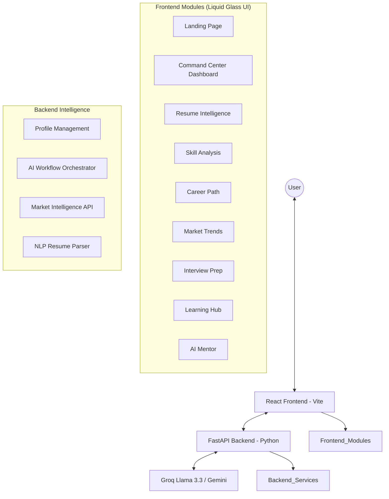
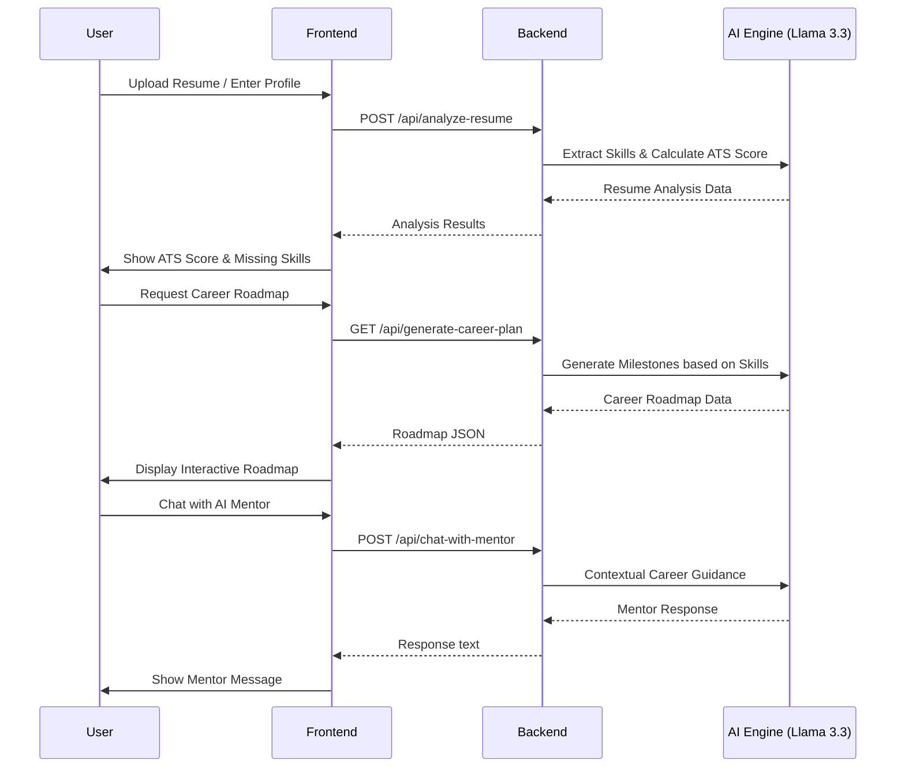

# AI-Powered SkillMapper

## Your Intelligent Career Command Center

**SkillMapper** is a premium, AI-driven career guidance platform designed to bridge the gap between academic potential and industry excellence. By leveraging state-of-the-art Large Language Models (LLMs) and a "Liquid Glass" UI aesthetic, SkillMapper provides users with a data-dense, interactive environment to navigate their professional growth.

---

## Architecture

The platform follows a modern, decoupled architecture designed for high performance and AI scalability.



---

## System Flow

The following diagram illustrates the core user journey from profile analysis to career roadmap generation.



---

## Core Features

### 1. Command Center (Dashboard)
A centralized hub aggregating intelligence from all modules. It provides a real-time view of your **Skill IQ**, **ATS Readiness**, **Market Match**, and **Interview Readiness**.

### 2. Resume Intelligence
- **ATS Scoring Engine**: Instant evaluation of your resume against industry standards.
- **Skill Extraction**: Automatic detection of core competencies and missing keywords.
- **Profile Optimization**: Actionable AI suggestions to improve resume visibility.

### 3. Skill Analysis
- **Competency Radar**: Multi-dimensional visualization of technical and soft skills.
- **Skill Tree Architecture**: A hierarchical view of your expertise levels.
- **Gap Detection**: Identification of the exact skills required for your target roles.

### 4. Career Path & Roadmaps
- **Dynamic Roadmapping**: AI-generated learning paths tailored to your current level.
- **Growth Milestones**: Structured phases from "Foundations" to "Specialization."
- **Progress Tracking**: Real-time monitoring of your journey toward career goals.

### 5. Market Trends & Salary Insights
- **Global Demand Index**: Live insights into trending technologies and roles.
- **Salary Benchmarking**: Entry to Senior level pay scales for target positions.
- **Hiring Analytics**: Monthly opening trends and industry growth rates.

### 6. Interview Preparation
- **AI Mock Interviews**: Simulated technical and HR interviews with real-time feedback.
- **Question Library**: Domain-specific question banks covering data structures, system design, and more.
- **Performance Feedback**: Detailed scorecards highlighting strengths and areas for improvement.

### 7. Learning Hub
- **Curation Engine**: Personalized resource recommendations (courses, blogs, documentation).
- **Study Plans**: Daily schedules to keep your learning on track.
- **Activity Log**: History of courses completed and assessments taken.

### 8. AI Mentor
- **24/7 Coaching**: Instant technical support and career strategy advice.
- **Context-Aware Guidance**: The mentor understands your profile, goals, and current progress.

---

## Tech Stack

### Frontend
- **Framework**: React 18+ (Vite)
- **Styling**: Vanilla CSS (Liquid Glass Design System)
- **Animations**: Framer Motion
- **Icons**: Lucide React
- **Charts**: Recharts

### Backend
- **Framework**: FastAPI (Python)
- **AI Integration**: Groq SDK (Llama 3.3 70B)
- **Utilities**: Pydantic, Uvicorn

### Development Tools
- **Concurrent Execution**: Node.js `concurrently` (runs both servers with one command)
- **Environment**: Dotenv for secure API key management

---

## Project Structure

```text
├── backend/
│   ├── main.py            # FastAPI Application & AI Routes
│   ├── requirements.txt   # Python Dependencies
│   └── package.json       # Backend Node scripts (optional)
├── frontend/
│   ├── src/
│   │   ├── pages/         # Core Modules (Dashboard, Resume, etc.)
│   │   ├── components/    # UI Components
│   │   └── App.jsx        # Routing & Theme Logic
│   └── package.json       # Frontend Dependencies
├── server.js              # Root orchestrator for dev environment
└── README.md              # Documentation
```

---

## Getting Started

### Prerequisites
- Node.js (v18+)
- Python (v3.9+)

### Installation

1. **Clone the repository**:
   ```bash
   git clone <repo-url>
   cd AI-Powered-SkillMapper
   ```

2. **Install Root & Frontend dependencies**:
   ```bash
   npm install
   cd frontend && npm install && cd ..
   ```

3. **Install Backend dependencies**:
   ```bash
   cd backend
   pip install -r requirements.txt
   cd ..
   ```

4. **Set up environment variables**:
   Create a `.env` file in the `backend/` directory:
   ```env
   GROQ_API_KEY=your_api_key_here
   ```

5. **Run the application**:
   From the root directory:
   ```bash
   npm start
   ```
   This will concurrently start the FastAPI backend (Port 5000) and the Vite frontend (Port 5173).

---

## Design Philosophy: Liquid Glass
The platform employs a **Liquid Glass** aesthetic, characterized by:
- **Translucency**: Frosted glass effects for panels and cards.
- **Vibrant Gradients**: Deep indigo, emerald, and rose accents.
- **Dynamic Motion**: Subtle Framer Motion transitions for a premium, alive feel.
- **Theme Awareness**: Seamless switching between "True Black" Dark Mode and a high-contrast Light Mode.

---

## Future Roadmap
- [ ] Integration with LinkedIn API for auto-profile syncing.
- [ ] Real-time job scraping and direct application links.
- [ ] Peer-to-peer mentorship matching.
- [ ] Institutional dashboards for university career centers.

---

Created by the SkillMapper Team.


